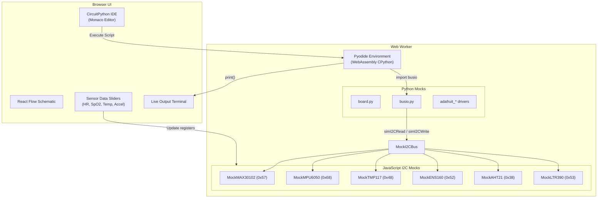

# IoT Schematic Canvas & Firmware Validator

A powerful web-based Electronic Design Automation (EDA) tool that allows you to visually wire IoT sensors and mock CircuitPython firmware directly in your browser. Built specifically for rapid prototyping and validation of fitness and health tracking wearable devices.

## 🚀 Features

- **Visual Schematic Editor**: Drag-and-drop React Flow canvas to connect Microcontrollers (e.g. XIAO nRF52840) to I2C sensors.
- **Real-Time Design Rule Check (DRC)**: Instantly detects I2C address conflicts, missing pull-up resistors, voltage mismatches, and improper power routing.
- **In-Browser Hardware Simulation**: Run actual CircuitPython scripts against your mock hardware. The app spins up a Pyodide WebAssembly environment with mocked `busio.I2C` and `board` pins.
- **Interactive Sensor Data Injection**: While the firmware runs, use UI sliders to inject live synthetic data (Heart Rate, SpO2, Temperature, UV Index, etc.) into the simulated I2C registers.

## 🔧 Supported Sensors

This environment currently provides high-fidelity I2C register mocks for the following hardware stack:

- **MAX30102** (`0x57`) — Pulse Oximetry and Heart-Rate
- **MPU-6050** (`0x68`) — 6-Axis Accelerometer and Gyroscope
- **TMP117** (`0x48`) — High-Accuracy Skin Temperature
- **ENS160 + AHT21** (`0x52` & `0x38`) — Multi-gas Air Quality & Humidity
- **LTR-390** (`0x53`) — UV Index & Ambient Light

## 🧠 Simulation Architecture

The simulation environment connects the React frontend to a Pyodide worker, injecting synthetic sensor data into CircuitPython drivers seamlessly.



## 🛠️ Step-by-Step Guide for Hackathon Teams

### 1. Installation

1. Make sure you have [Node.js](https://nodejs.org/) installed.
2. Clone this repository.
3. Install dependencies:
   ```bash
   npm install
   ```
4. Start the development server:
   ```bash
   npm run dev
   ```
5. Open your browser and navigate to the localhost URL (usually `http://localhost:5173`).

### 2. Using the Schematic Canvas

1. **Add Components:** Drag a Microcontroller (like the XIAO nRF52840) and various I2C sensors from the right palette onto the canvas.
2. **Wire Them Up:** Drag from pin handles to connect `3V3` to `VIN/VCC`, `GND` to `GND`, `SDA` to `SDA`, and `SCL` to `SCL`.
3. **Verify DRC:** Check the top-right panel. It will instantly tell you if you have any address conflicts (e.g. an ENS160 at `0x53` conflicting with the LTR-390).

### 3. Running Firmware Simulations

1. **Enter Simulation Mode:** Click the **"Simulate"** button in the top right of the toolbar.
2. **Write Firmware:** The bottom panel will open up an IDE. Paste your real CircuitPython firmware into the code editor. It supports standard imports like `import board, busio, adafruit_mpu6050`.
3. **Execute:** Click **"Run Script"** (green button). The Pyodide engine will initialize (takes ~10s the first time) and begin printing to the terminal.
4. **Inject Live Data:** While the script runs, go to the left sidebar (Sensor Test Data). Drag the sliders (e.g., Heart Rate, Temperature). The UI updates the mock I2C registers in real-time, and your running Python code will instantly read the new data!

### 4. Exiting Simulation

Click the **"Exit Sim Mode"** button to terminate the Python execution, clear the terminal, and return to schematic editing.

---
*Built for rapid IoT prototyping and seamless hardware-software co-validation.*
